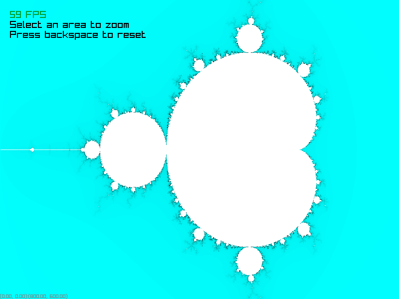
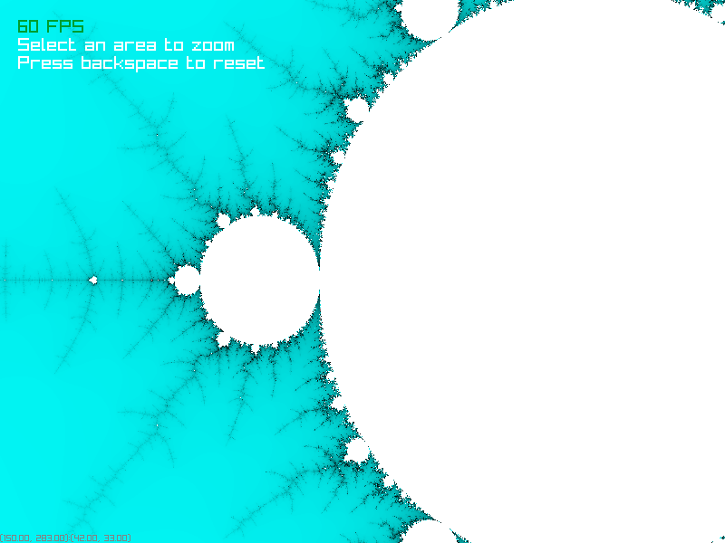

# Mandelbrot Set Viewer

This project is a fairly simple fractal viewer for the Mandelbrot Set. The project is written in Java+JNI, such that the actual calculation of the fractal, and the [graphics library]() are written in C++, and the code to tie the two together is written in Java. The main feature of this program is that the user can zoom in and out by selecting areas of the window. It also runs at a smooth 60FPS on nearly all computers.

## Screenshots



*Default zoom*



*Zoomed in*

## Development

This project is only tested and developed on Linux, but in theory supports Windows, BSD, Darwin, and Linux. To run, clone this repo, then run:

```sh
./gradlew fullBuildRun
```